# Sales Analysis Using BigQuery

### - We have been assigned to analyse the bike store sales using BigQuery.
### -  We have 9 relational tables having distinct primary keys and foreign keys. 

### Among the tables, 'orders' is a fact table and all other tables are dimensional and sub-dimensional. 

### First, we must create the dataset in the BigQuery project and upload all the tables.
### Refer to the following image,

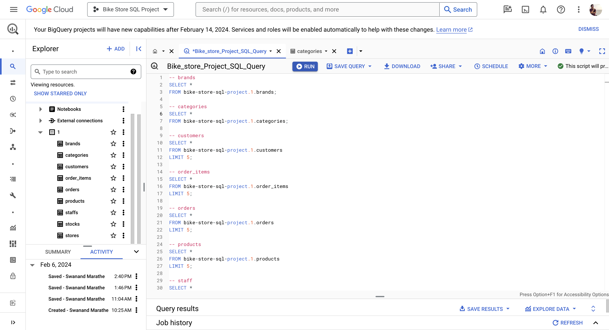

### Now let's first explore all the tables.

-- brands
<pre>
SELECT * 
FROM bike-store-sql-project.1.brands;
</pre>

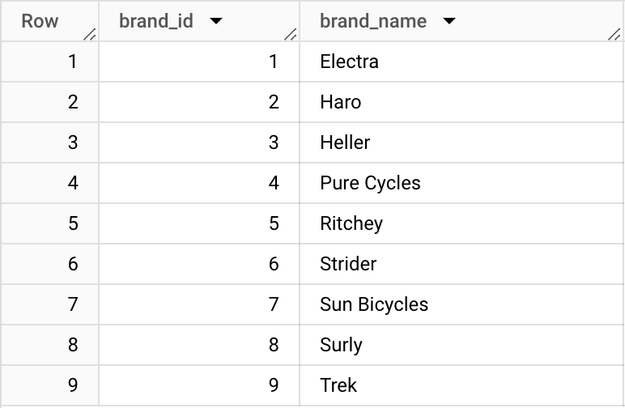

-- categories
<pre>
SELECT * 
FROM bike-store-sql-project.1.categories;
</pre>

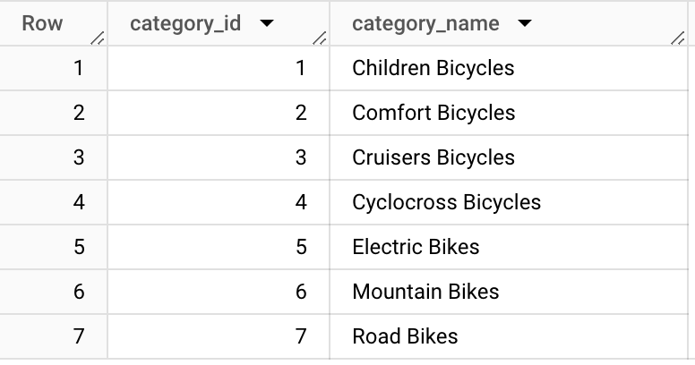

-- customers
<pre>
SELECT * 
FROM bike-store-sql-project.1.customers
LIMIT 5;
</pre>

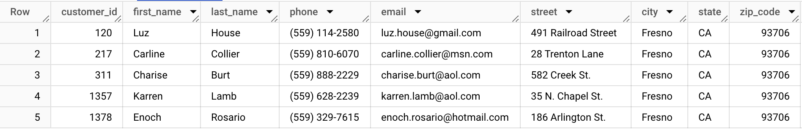

-- order_items
<pre>
SELECT *
FROM bike-store-sql-project.1.order_items
LIMIT 5;
</pre>

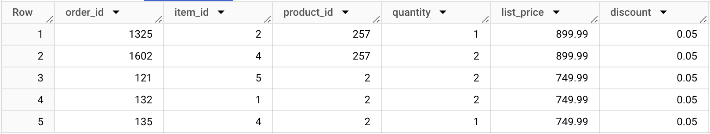

-- orders
<pre>
SELECT *
FROM bike-store-sql-project.1.orders
LIMIT 5;
</pre>

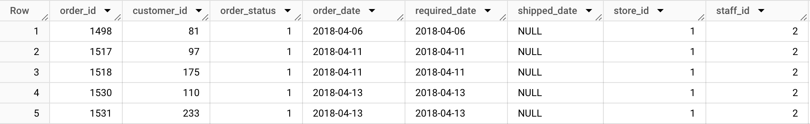

-- products
<pre>
SELECT *
FROM bike-store-sql-project.1.products
LIMIT 5;
</pre>

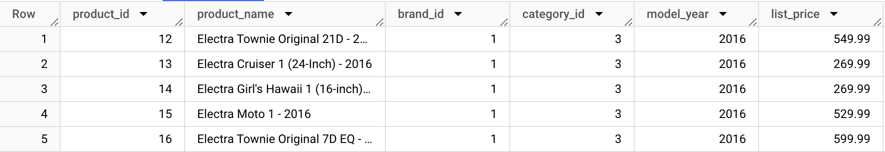

-- staff
<pre>
SELECT *
FROM bike-store-sql-project.1.staffs
LIMIT 5;
</pre>

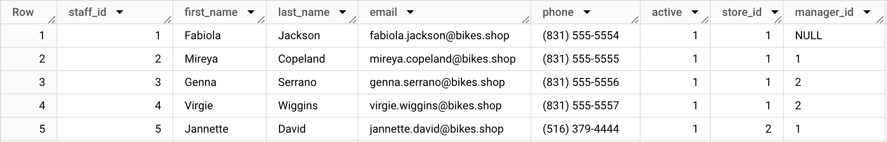

-- stocks
<pre>
SELECT *
FROM bike-store-sql-project.1.stocks
ORDER BY quantity DESC
LIMIT 5;
</pre>

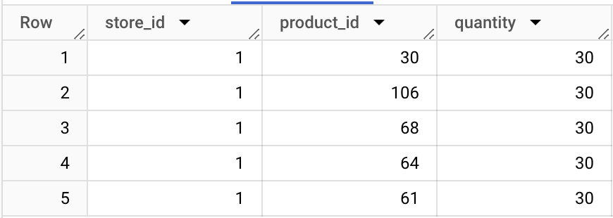

-- stores
<pre>
SELECT *
FROM bike-store-sql-project.1.stores
LIMIT 5;
</pre>

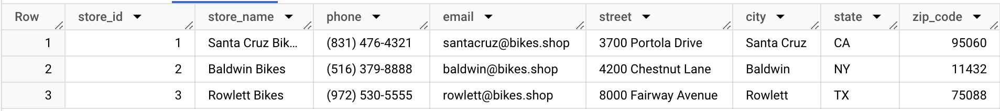

### Now let's have a look at how many distinct products does company has sold.
<pre>
SELECT 
 COUNT(DISTINCT product_name)
FROM 
 bike-store-sql-project.1.products AS products;
</pre>

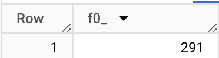

### Which are the top 10 highest sold products and number of quantities sold per product?
<pre>
WITH order_products AS (
 SELECT *
 FROM 
  bike-store-sql-project.1.orders AS o
 JOIN 
  bike-store-sql-project.1.order_items AS oi
 ON 
  o.order_id = oi.order_id
JOIN 
  bike-store-sql-project.1.products AS p
 ON 
  oi.product_id = p.product_id
 )

 SELECT 
  op.product_name, 
  COUNT(*) AS no_product_sold
 FROM 
  order_products AS op
 GROUP BY 1
 ORDER BY 2 DESC
 LIMIT 10;
</pre>

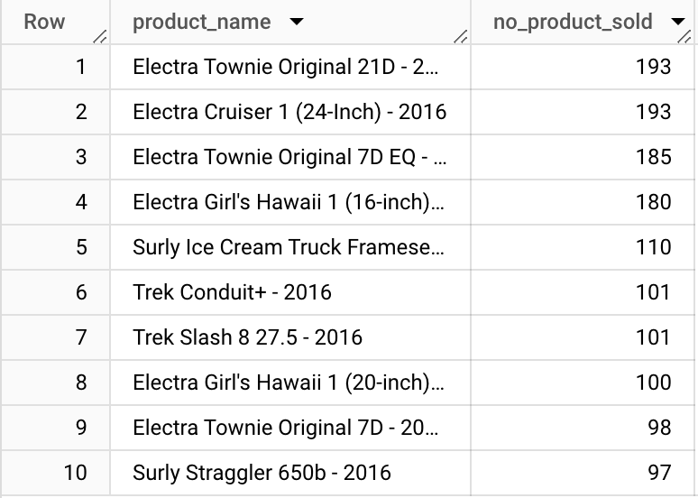

 
### Let's have a look, How many total products were sold by each brand? Which is the Highest-selling brand by Volume? and its share?
<pre>
WITH brand_orders AS (
 SELECT *
 FROM 
  bike-store-sql-project.1.orders AS o
 JOIN 
  bike-store-sql-project.1.order_items AS oi
  ON 
   o.order_id = oi.order_id
 JOIN 
   bike-store-sql-project.1.products AS p
  ON 
    oi.product_id = p.product_id
 JOIN 
  bike-store-sql-project.1.brands as b
  ON 
   p.brand_id = b.brand_id
 )
 SELECT 
  bo.brand_name, COUNT(*) AS no_product_sold_per_brand, 
  ROUND((COUNT(*) / SUM(COUNT(*)) OVER ()),2) * 100 AS total_share
 FROM brand_orders AS bo
 GROUP BY 1
 ORDER BY 2 DESC;
</pre>

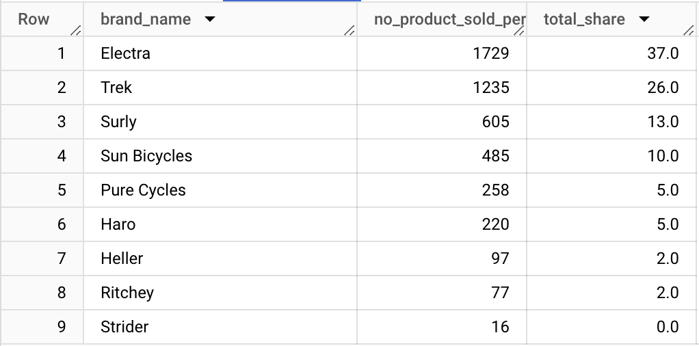

 
### Which month of the year was the highest sold month? What is a share over total both by volume and value?
 <pre>
WITH order_products AS 
 (
  SELECT *
  FROM 
   bike-store-sql-project.1.orders AS o
  JOIN 
   bike-store-sql-project.1.order_items AS oi
   ON 
    o.order_id = oi.order_id
  )
 SELECT 
  EXTRACT(MONTH FROM op.order_date) AS months, COUNT (*) as no_items_sold, 
  ROUND((COUNT(*) / SUM(COUNT(*)) OVER ())*100, 2) AS perc_share_by_volume, 
  ROUND(SUM(op.list_price)) AS total_sale, 
  ROUND((SUM(op.list_price) / SUM(SUM(op.list_price)) OVER())*100, 2) as perc_share_by_value
 FROM order_products AS op
 GROUP BY 1
 ORDER BY 2 DESC;
</pre>

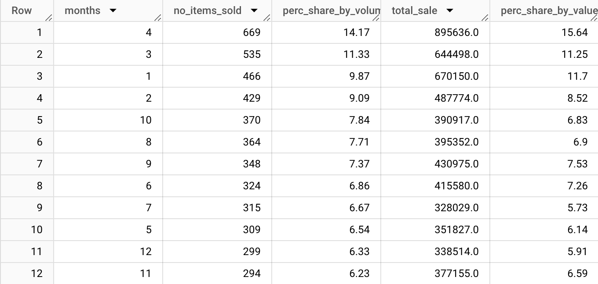

### Let's have a look at the Quarter level, What is the sale both by value and volume each quarter and its share over the year?
<pre>
WITH order_products AS (
 SELECT *
 FROM 
  bike-store-sql-project.1.orders AS o
 JOIN 
  bike-store-sql-project.1.order_items AS oi
  ON 
   o.order_id = oi.order_id

 )
SELECT 
   CASE
    WHEN EXTRACT(MONTH FROM op.order_date) IN (1, 2, 3) THEN 'Q1'
    WHEN EXTRACT(MONTH FROM op.order_date) IN (4, 5, 6) THEN 'Q2'
    WHEN EXTRACT(MONTH FROM op.order_date) IN (7, 8, 9) THEN 'Q3'
    WHEN EXTRACT(MONTH FROM op.order_date) IN (10, 11, 12) THEN 'Q4'
    ELSE NULL 
   END AS quarter,
   COUNT (*) as no_items_sold, 
   ROUND((COUNT(*) / SUM(COUNT(*)) OVER ())*100, 2) AS perc_share_by_volume, 
   ROUND(SUM(op.list_price)) AS total_sale, 
   ROUND((SUM(op.list_price) / SUM(SUM(op.list_price)) OVER())*100, 2) as perc_share_by_value
FROM order_products AS op
GROUP BY 1
ORDER BY 2 DESC;
</pre>

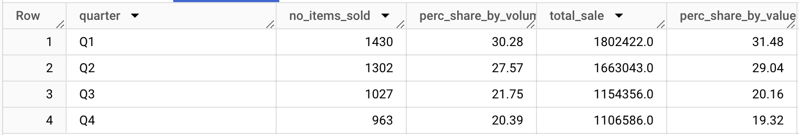

### Now let's explore products sold across the stores.
<pre>
 WITH store_sale AS 
 (
  SELECT *
  FROM 
   bike-store-sql-project.1.orders AS o
  JOIN 
   bike-store-sql-project.1.stores as st
   ON 
    o.store_id = st.store_id
  JOIN 
   bike-store-sql-project.1.order_items AS oi
   ON 
   o.order_id = oi.order_id
  JOIN 
   bike-store-sql-project.1.products AS p
   ON 
    oi.product_id = p.product_id
 )

 SELECT 
  sts.store_name, 
  COUNT(*) AS no_product_sold
 FROM store_sale AS sts
 GROUP BY 1
 ORDER BY 2 DESC;
</pre>

 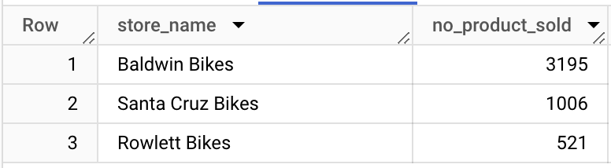

### Who is the best performer across stores? Belongs to which store? and what is the total sale made by volume as well as value?
<pre>
WITH staff_orders AS 
(
 SELECT *
 FROM 
  bike-store-sql-project.1.orders AS o
 JOIN 
  bike-store-sql-project.1.staffs AS stf
  ON 
   o.staff_id = stf.staff_id
 JOIN 
  bike-store-sql-project.1.order_items AS oi
  ON 
   o.order_id = oi.order_id
 JOIN 
  bike-store-sql-project.1.stores AS str
  ON 
   stf.store_id = str.store_id
)
SELECT 
 CONCAT(so.first_name,' ',so.last_name) AS full_name,so.store_name, 
 COUNT(*) AS total_product_sold, 
 ROUND(SUM(so.list_price),2) AS total_sale
FROM staff_orders AS so
GROUP BY 1,2
ORDER BY 4 DESC;
</pre>

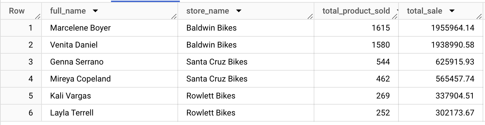

## Conclusions
### 1. 'Electra' is the highest sold brand by volume with each product having over 180 quantities sold and also holds the highest share by volume at 37% followed by 'Trek' at 26% and Surly at 13%.
### 2. 'April' has been the highest-selling month of the year with a share of both volume and value standing around 15%, followed by 'March' at 11%.
### 3. 'Q1' Stands to be the highest sales quarter with a share of the total of around 31% both by volume and value, followed by Q2 at around 28%. Whereas Q3 and Q4 both stand at 20%.
### 4. 'Baldwin Bikes' store is the highest-selling store, having sales of more than twice that of the other two stores put together.
### 5. 'Marcelene Boyer' and 'Venita Daniel' are the best-performing employees with the highest sales. both belong to the 'Baldwin Bikes' store.
