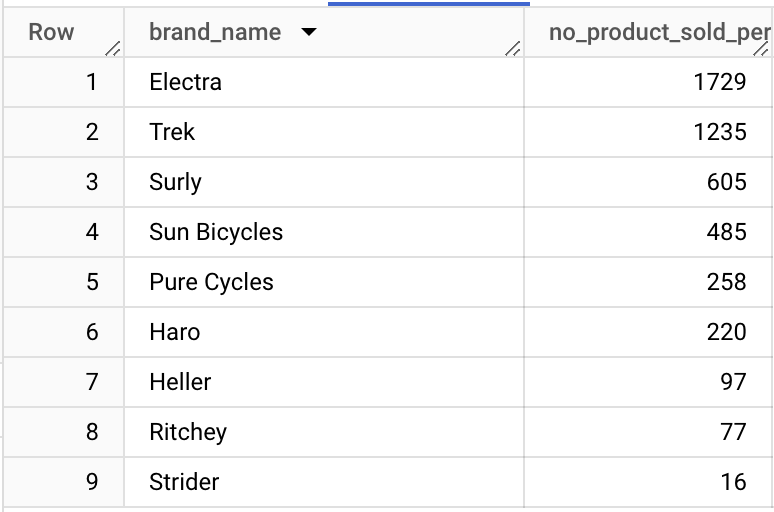
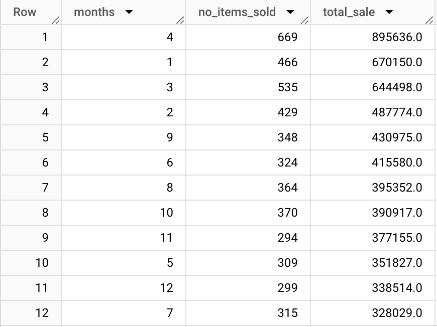

# Sales Analysis Using BigQuery

### - We have been assigned to analyse the bike store sales using BigQuery.
### -  We have 9 relational tables having distinct primary keys and foreign keys. 

### Among the tables, 'orders' is a fact table and all other tables are dimensional and sub-dimensional. 

### First, we must create the dataset in the BigQuery project and upload all the tables.
### Refer to the following image,

### Now let's first explore all the tables.

-- brands

SELECT * 
FROM bike-store-sql-project.1.brands;

-- categories

SELECT * 
FROM bike-store-sql-project.1.categories;

-- customers

SELECT * 
FROM bike-store-sql-project.1.customers
LIMIT 5;

-- order_items

SELECT *
FROM bike-store-sql-project.1.order_items
LIMIT 5;

-- orders

SELECT *
FROM bike-store-sql-project.1.orders
LIMIT 5;

-- products

SELECT *
FROM bike-store-sql-project.1.products
LIMIT 5;

-- staff

SELECT *
FROM bike-store-sql-project.1.staffs
LIMIT 5;

-- stocks

SELECT *
FROM bike-store-sql-project.1.stocks
ORDER BY quantity DESC
LIMIT 5;

-- stores

SELECT *
FROM bike-store-sql-project.1.stores
LIMIT 5;

### Now lets have a look at how many distinct products does company has sold.

SELECT COUNT(DISTINCT product_name)
FROM bike-store-sql-project.1.products AS products;

### Which are the top 10 highest sold product and number of quantities sold per product?
WITH order_products AS 

(

SELECT *
FROM bike-store-sql-project.1.orders AS o
JOIN bike-store-sql-project.1.order_items AS oi
 ON o.order_id = oi.order_id
JOIN bike-store-sql-project.1.products AS p
 ON oi.product_id = p.product_id
 )

 SELECT op.product_name, COUNT(*) AS no_product_sold
 FROM order_products AS op
 GROUP BY 1
 ORDER BY 2 DESC
 LIMIT 10;

 
### Lets have a look, How many total products were sold by each brand? Which is Highest sellling brand by Volume?

WITH brand_orders AS 

(

SELECT *
FROM bike-store-sql-project.1.orders AS o
JOIN bike-store-sql-project.1.order_items AS oi
 ON o.order_id = oi.order_id
JOIN bike-store-sql-project.1.products AS p
 ON oi.product_id = p.product_id
JOIN bike-store-sql-project.1.brands as b
 ON p.brand_id = b.brand_id
 )

 SELECT bo.brand_name, COUNT(*) AS no_product_sold_per_brand
 FROM brand_orders AS bo
 GROUP BY 1
 ORDER BY 2 DESC;

### Now lets explore products sold across the stores.
 WITH store_sale AS 
 
 (

SELECT *
FROM bike-store-sql-project.1.orders AS o
JOIN bike-store-sql-project.1.stores as st
 ON o.store_id = st.store_id
JOIN bike-store-sql-project.1.order_items AS oi
 ON o.order_id = oi.order_id
JOIN bike-store-sql-project.1.products AS p
 ON oi.product_id = p.product_id
 )

 SELECT sts.store_name, COUNT(*) AS no_product_sold
 FROM store_sale AS sts
 GROUP BY 1
 ORDER BY 2 DESC;

 

 
### Which month of year was highest sold month?
 WITH order_products AS 
 
 (

SELECT *
FROM bike-store-sql-project.1.orders AS o
JOIN bike-store-sql-project.1.order_items AS oi
 ON o.order_id = oi.order_id
 )
 
 SELECT EXTRACT(MONTH FROM op.order_date) AS months, COUNT (*) as no_items_sold, ROUND(SUM(op.list_price)) AS total_sale
FROM order_products AS op
GROUP BY 1
ORDER BY 3 DESC;

### Who is the best performer across stores? Belongs to which store? and what is the total sale made by volume as well as value?
WITH staff_orders AS 

(

SELECT *
FROM bike-store-sql-project.1.orders AS o
JOIN bike-store-sql-project.1.staffs AS stf
 ON o.staff_id = stf.staff_id
JOIN bike-store-sql-project.1.order_items AS oi
 ON o.order_id = oi.order_id
JOIN bike-store-sql-project.1.stores AS str
 ON stf.store_id = str.store_id

)

SELECT CONCAT(so.first_name,' ',so.last_name) AS full_name,so.store_name, COUNT(*) AS total_product_sold, ROUND(SUM(so.list_price),2) AS total_sale
FROM staff_orders AS so
GROUP BY 1,2
ORDER BY 4 DESC;

